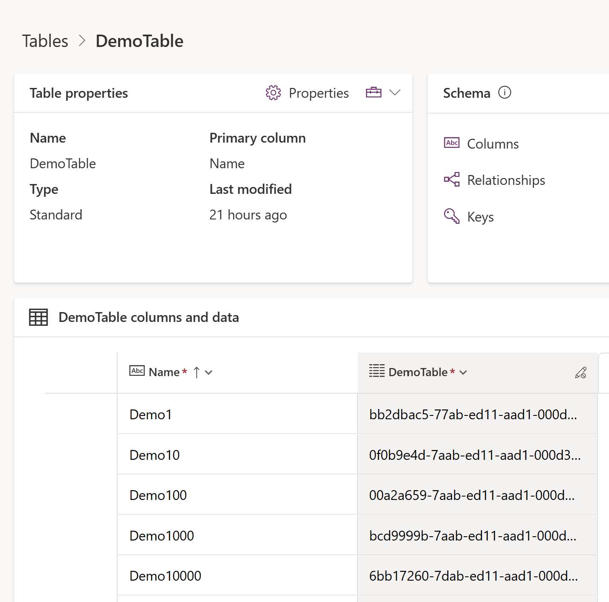
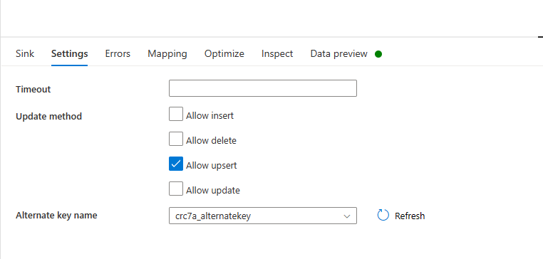
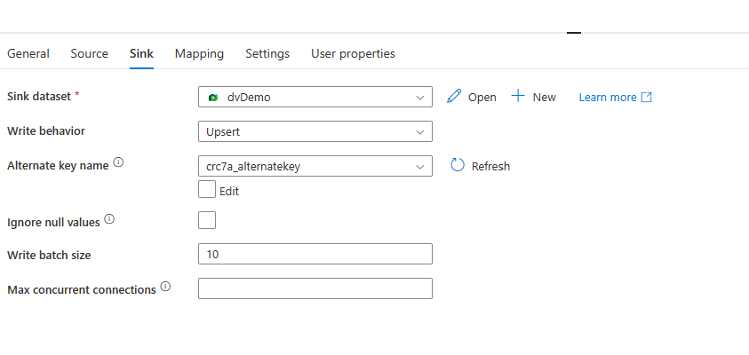
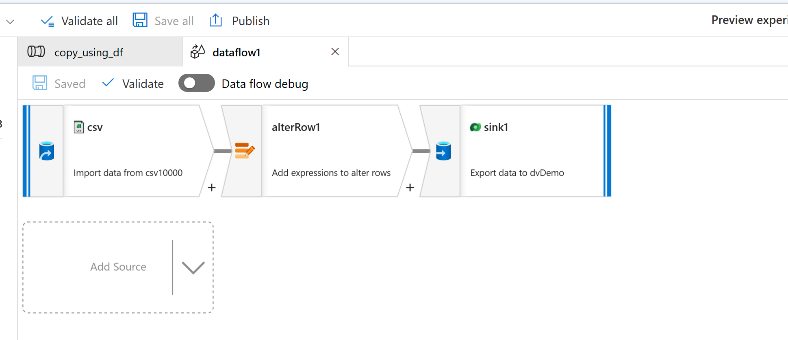
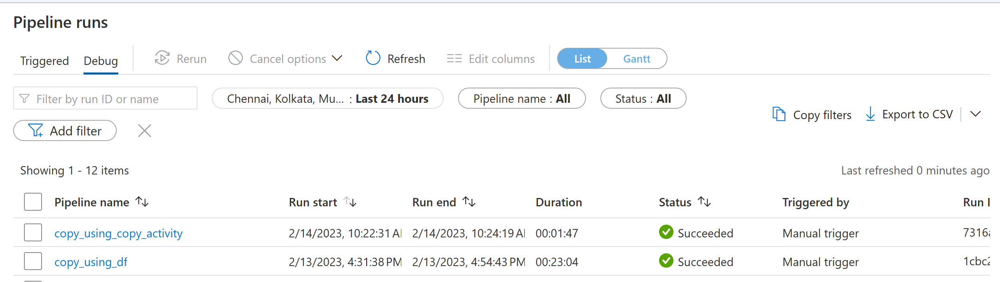
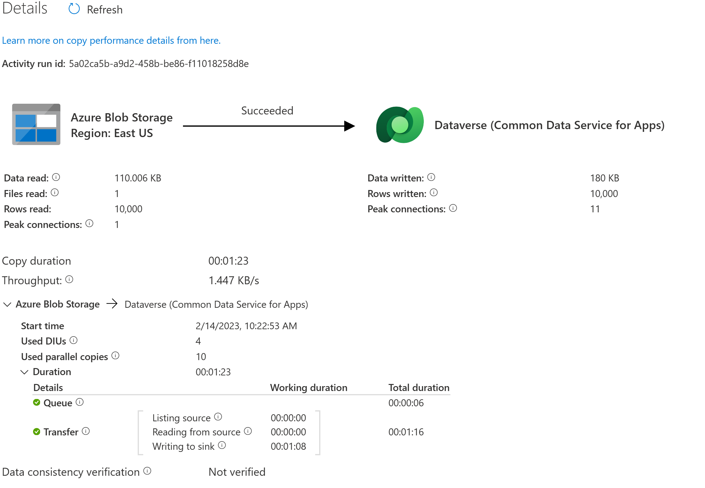
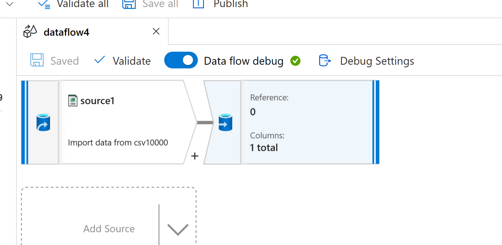
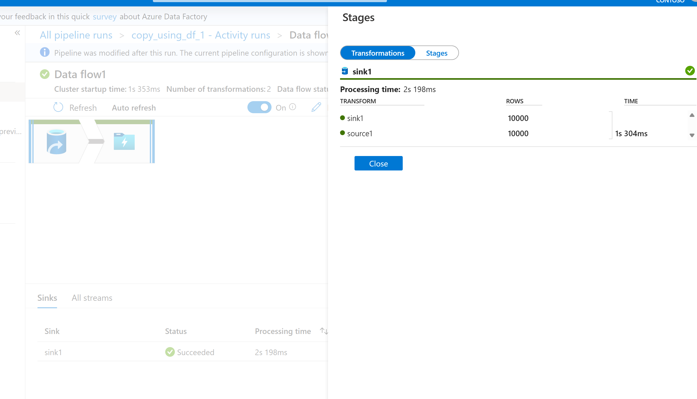

# Overview

This document covers the performance aspects of inserting data from a csv file to a Dataverse table using dataflow and copy activity in Azure Data Factory(ADF).

## Scenario

Scenario is to copy data from a CSV file in a blob storage containing 10000 records into a Dataverse table. To explain the issue we have created a simple dataverse table with following schema.


As shown, in above screenshot we have only one column(`Name`) added to the table and remaining columns are created by Dataverse. `DemoTable` column is a unique guid and created by Dataverse. We also created `alternate key` in dataverse table so that we can perform `upsert` operations based the Name provided in CSV file. To copy data we used [dynamics connector](https://learn.microsoft.com/en-us/azure/data-factory/connector-dynamics-crm-office-365?tabs=data-factory) which is available in ADF pipelines as part of Linked Services.

Here is the sample format of CSV file which we used to insert into dataverse table.

```csv
Name
Demo60000
Demo60001
Demo60002
Demo60003
Demo60004
```

## Two approaches to copy data from CSV to Dataverse

Source code of both these approaches are available in [this location.](./code-samples/performance_sample/adf_code/)

### Dataflow activity

We can use dataflow activity to copy data from csv to dataverse table. Here are the steps followed in dataflow activity

1. Use `Source` to select the CSV.
1. Use `Select` to select columns from CSV which are needed to be insert into Dataverse.
1. In `Sink` dataverse table is selected.
1. In sink settings `Allow upsert` and `alternate key` are also selected.


### Copy activity

We can use copy activity to copy data from CSV file to Dataverse. Here are the steps followed in copy activity

1. Select CSV as source dataset.
1. Select Dataverse table as sink dataset and `Upsert` and `alternate key` in sink settings.

1. To add `Upsert` operation, it also asks to have `Alter Row`.
Here is screenshot of the dataflow activity


## Performance Numbers

| Number of Records | Copy Activity(mins) | DataFlow Activity(mins|
|-------------------|---------------|------------------|
| 10000| 1.47 | 23.04 |



Breakdown of time taken of dataflow activity by stages
![dataflow activity stages]./assests/images/dataflow_stages.png)

Copy Activity details


### *Note:*

We did one more test in dataflow activity by removing dataverse sink and adding BlobStorage as sink. It took around 2s to complete that operation.
Here is the screenshot of the data pipeline.


Here is the screenshot the time taken


## Summary

As shown from the above data that time taken to insert 10K records via copy activity is ~ 1min but same data insertion took around ~23 mins in dataflow activity.

## References

[Alternate Key](https://learn.microsoft.com/en-us/power-apps/maker/data-platform/define-alternate-keys-portal)

[Connector Dynamics](https://learn.microsoft.com/en-us/azure/data-factory/connector-dynamics-crm-office-365?tabs=data-factory)
