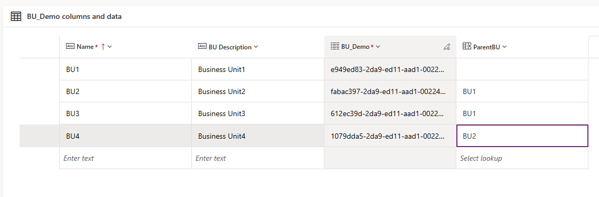
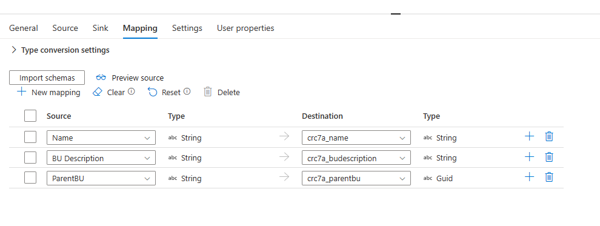

# Overview

This document covers the approach of inserting data into dataverse table having lookup columns.

## Problem Statement

Consider an example where we have a Dataverse table with following columns

1. Name
1. BU Description
1. ParentBU (Self Referential Lookup)
1. BU_Demo(Auto generate unique Guid)

All Microsoft Dataverse table rows have unique identifiers defined as GUIDs. These are the primary key for each table. In current example `BU_Demo` is the unique identifier column.



If we want to insert records from following csv into this table, then we need to map the columns from CSV to Dataverse table.

```csv
Name,BU Description,ParentBU
BU5,Business Unit5,BU1
BU6,Business Unit6,BU3
BU7,Business Unit7,BU2

```

In the above csv, ParentBU contains the name of parent business unit. But to insert these records into dataverse table we need to supply parentbu guid, since parent is a lookup column.

In below screenshot we can see mapping from csv to Dataverse table and as shown below "ParentBU" is mapped to column "crc71_parentbu" which has a type of GUID.



Hence, somehow we need to get the parent guid before inserting the records from above csv.
This is applicable to other scenarios where we have lookup columns having referential integrity with other tables.

## Solution

To solve the above problem we follow the approach of two pass operation. Code sample for this solution can be found in [this repo.](./code-samples/two_pass_insert/)
Here are the steps:

1. Create an [alternate key in dataverse table.](https://learn.microsoft.com/en-us/power-apps/developer/data-platform/define-alternate-keys-entity) Since we don't have actual guid from dataverse table, so this key can be used to perform upsert operations.
1. Copy Activity
    1. Create dataset from CSV without Parent column or lookup column.
    1. Insert the dataset into dataverse table.
1. DataFlow Activity
    1. Use dataflow to create a dataset having join from CSV and Dataverse table on the Name column.
    1. Now the dataset contains parent guid.
    1. In mapping step remove the original parent column and keep the new parent guid.
    1. Write the created dataset to dataverse table using sink or copy activity.

This is the simplest approach which can help us to get the referential column guid before any insert/upsert operation.

### Note

1. Since above solution requires two passes on dataverse, so we need to be careful in terms of Dataverse API usage.
1. This solution will work if there are no mandatory lookup columns. To avoid any issues we can make all lookup columns as optional.
1. This solution can also be further  optimized to reduce the number of API calls.

### References

1. [Alternate Keys](https://learn.microsoft.com/en-us/power-apps/developer/data-platform/define-alternate-keys-entity)
